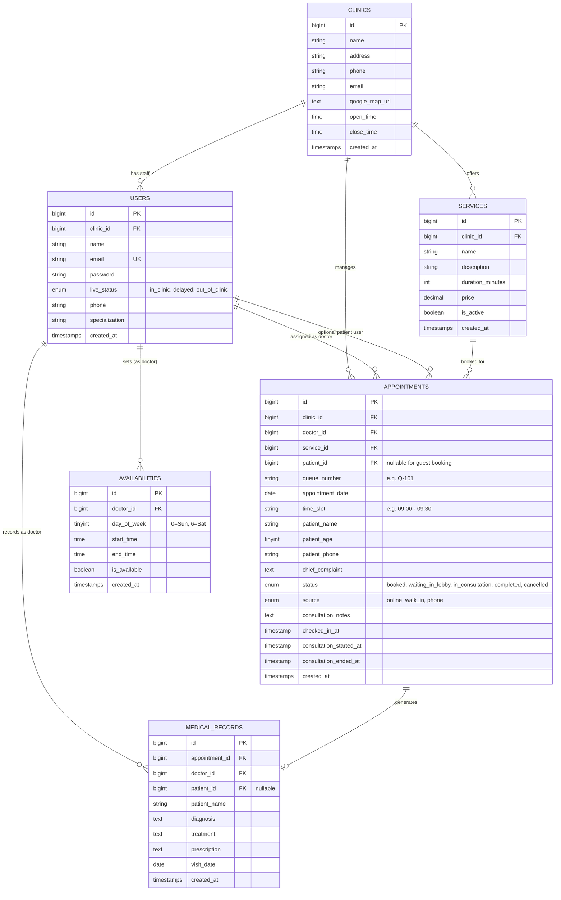

# Clinic Connect MVP Specification & Plan

> **Based on Project Plan:** Clinic Management MVP (3-Day Web Prototype)  
> **Source Reference:** [Google Docs Project Plan](https://docs.google.com/document/d/14Kmg8CJMwtndz2YLBpGLbXGLQWh3UrLsKNjKQ9RufFE/edit?usp=sharing)  
> **Timeline:** 3 Business Days (1 Full-Stack Engineer)  
> **Primary Objective:** Deliver an interactive web demonstration portal to validate and showcase automated booking and queue visibility to clinic decision-makers.

---

## 1. Executive Summary & Core Objective

The **Clinic Connect MVP** is a responsive web application prototype focused on solving the core friction points in daily outpatient clinic operations:
1. **Frictionless Patient Booking:** Public self-service booking accessible from mobile and desktop browsers without requiring app downloads or upfront account creation.
2. **Receptionist Queue Coordination:** Real-time visibility of scheduled appointments and walk-in arrivals, with rapid one-click patient status transitions.
3. **Doctor Workspace Efficiency:** Immediate visibility into waiting room backlog, live doctor status toggles, and distraction-free patient cards with quick consultation notes.

Our approach starts with **Database Architecture First** to ensure that models, migrations, relationships, and seeders cleanly support all 3 user roles, public guest bookings, queue numbers, and real-time state progressions.

---

## 2. Core Feature Scope

### A. Patient Self-Service Booking Page (Public Web Portal)
- **Zero-Friction Access:** Publicly accessible page with responsive layout optimized for mobile smartphones and desktop browsers (no authentication barrier).
- **Specialist & Service Selection:**
  - Select Doctor / Specialist from clinic roster.
  - Select Visit Type / Service (e.g., *General Consultation*, *Pediatric Immunization*, *Follow-up Consultation*).
- **Available Slot Picker:**
  - Date selector.
  - Morning and afternoon appointment slot windows based on doctor availability and existing bookings.
- **Patient Information Capture:**
  - Patient Full Name
  - Age
  - Contact Number (Mobile Phone)
  - Chief Complaint / Reason for Visit
- **Instant Web Confirmation & Digital Queue Token:**
  - Immediate on-screen confirmation card displaying:
    - Assigned Queue Number (e.g., `Q-101`)
    - Doctor Name & Specialty
    - Visit Date & Slot Time Window
    - Patient Name & Service Type
    - Live Status Badge (`Booked`)

---

### B. Secretary / Receptionist Queue Dashboard (Desktop Web)
- **Unified Real-Time Queue Table:**
  - Live table of all scheduled bookings and walk-ins for the day.
  - Columns: Queue #, Patient Name, Age, Contact, Service Type, Doctor, Source (`Online` / `Walk-in`), Status, Arrival Time, Actions.
  - Filter by Doctor or Status tabs (`All`, `Waiting`, `In Consultation`, `Completed`).
- **Rapid Walk-in Ingestion Modal (`+ Add Walk-in`):**
  - Ultra-fast entry modal (fills in seconds during front-desk rush or phone calls).
  - Captures: Name, Age, Phone, Doctor, Service, Chief Complaint.
  - Immediately generates the next daily queue number and places the patient in the queue as `Waiting in Lobby`.
- **One-Click Patient Status Transitions:**
  - Linear status advancement:
    $$\text{Booked} \longrightarrow \text{Waiting in Lobby} \longrightarrow \text{In Consultation} \longrightarrow \text{Completed}$$
  - Quick action buttons on each row:
    - **Check In** (transitions `Booked` &rarr; `Waiting in Lobby`)
    - **Call Patient** (transitions `Waiting in Lobby` &rarr; `In Consultation`)
    - **Complete** (transitions `In Consultation` &rarr; `Completed`)
    - **Cancel / No Show** (modal or dropdown option)

---

### C. Doctor Workspace (Tablet / Desktop Web)
- **Live Availability Toggle (Header Control):**
  - Instant status switch:
    - 🟢 **In Clinic** (Ready for next patient)
    - 🟡 **Delayed** (Running behind schedule)
    - 🔴 **Out of Clinic** (Break / Away / Off-duty)
  - Updates clinic-wide state and reception dashboard in real time.
- **Active Waiting Room Queue Counter:**
  - Prominent badge displaying the count of patients currently `Waiting in Lobby`.
- **Focused Active Patient Card & Consultation Notes:**
  - Clean, distraction-free view of the patient currently `In Consultation`:
    - Patient Name, Age, Contact #, Chief Complaint, Service Type, Arrival Time.
  - Expandable / Quick Text Area for **Clinical Notes** (observations, diagnosis summary, advice).
  - One-click **"Done / Complete Consultation"** button:
    - Saves consultation notes to the appointment and medical records.
    - Transitions appointment status to `Completed`.
    - Automatically prompts or queues the next waiting patient.

---

## 3. Database Architecture (Database-First Strategy)

To support public self-service booking, fast receptionist queue actions, and doctor workspaces, the database is structured as follows:

### Table Definitions & Field Specifications

#### 1. `clinics`
| Column | Type | Attributes | Description |
|---|---|---|---|
| `id` | BigIncrements | Primary Key | |
| `name` | String(255) | Not Null | Clinic name (e.g., "Metro Health Clinic") |
| `address` | Text | Nullable | Street address |
| `phone` | String(50) | Nullable | Primary contact number |
| `email` | String(100) | Nullable | Contact email |
| `google_map_url` | Text | Nullable | Embed / Maps link |
| `open_time` | Time | Nullable | Daily opening time (e.g., 08:00) |
| `close_time` | Time | Nullable | Daily closing time (e.g., 17:00) |
| `created_at` / `updated_at` | Timestamps | Not Null | |

#### 2. `users` (Staff & System Accounts)
| Column | Type | Attributes | Description |
|---|---|---|---|
| `id` | BigIncrements | Primary Key | |
| `clinic_id` | ForeignId | Nullable, Indexed | Belongs to clinic |
| `name` | String(255) | Not Null | User / Doctor / Staff name |
| `email` | String(255) | Unique, Not Null | Login email |
| `password` | String(255) | Not Null | Hashed password |
| `phone` | String(50) | Nullable | Staff phone number |
| `specialization` | String(100) | Nullable | E.g., "Pediatrics", "General Medicine" |
| `live_status` | Enum | Default `in_clinic` | `in_clinic`, `delayed`, `out_of_clinic` (for doctors) |
| `roles` | Spatie RBAC | Roles: `Doctor`, `Secretary`, `Admin`, `Patient` |

#### 3. `services` (Clinic Visit Offerings)
| Column | Type | Attributes | Description |
|---|---|---|---|
| `id` | BigIncrements | Primary Key | |
| `clinic_id` | ForeignId | Constrained `clinics` | Associated clinic |
| `name` | String(255) | Not Null | E.g., "General Consultation", "Pediatric Immunization" |
| `description` | Text | Nullable | Service details |
| `duration_minutes` | Integer | Default: 20 | Estimated appointment window |
| `price` | Decimal(10,2) | Nullable | Consultation fee |
| `is_active` | Boolean | Default: `true` | Display in booking selector |
| `created_at` / `updated_at` | Timestamps | Not Null | |

#### 4. `availabilities` (Doctor Recurring Availability)
| Column | Type | Attributes | Description |
|---|---|---|---|
| `id` | BigIncrements | Primary Key | |
| `doctor_id` | ForeignId | Constrained `users` | Doctor user reference |
| `day_of_week` | TinyInteger | 0 (Sunday) to 6 (Saturday) | Operating day |
| `start_time` | Time | Not Null | Shift start (e.g., `09:00:00`) |
| `end_time` | Time | Not Null | Shift end (e.g., `17:00:00`) |
| `is_available` | Boolean | Default: `true` | Toggle active status |
| `created_at` / `updated_at` | Timestamps | Not Null | |

#### 5. `appointments` (Queue, Booking & Real-time State)
| Column | Type | Attributes | Description |
|---|---|---|---|
| `id` | BigIncrements | Primary Key | |
| `clinic_id` | ForeignId | Constrained `clinics` | |
| `doctor_id` | ForeignId | Constrained `users` | Designated physician |
| `service_id` | ForeignId | Nullable, Constrained `services` | Visit type |
| `patient_id` | ForeignId | Nullable, Constrained `users` | Optional link to registered patient account |
| `queue_number` | String(20) | Indexed | Daily queue token (e.g. `Q-101`, `Q-102`) |
| `appointment_date` | Date | Indexed | Date of appointment |
| `time_slot` | String(50) | Nullable | E.g. "09:00 - 09:30" or "Morning Window" |
| `patient_name` | String(255) | Not Null | Captured name (works for guest & walk-ins) |
| `patient_age` | SmallInteger | Nullable | Captured age |
| `patient_phone` | String(50) | Not Null | Contact phone number |
| `chief_complaint` | Text | Nullable | Reason for visit / symptoms |
| `status` | Enum | Default: `booked` | `booked`, `waiting_in_lobby`, `in_consultation`, `completed`, `cancelled` |
| `source` | Enum | Default: `online` | `online`, `walk_in`, `phone` |
| `consultation_notes` | Text | Nullable | Doctor's quick notes taken during consultation |
| `checked_in_at` | Timestamp | Nullable | When status became `waiting_in_lobby` |
| `consultation_started_at` | Timestamp | Nullable | When doctor called patient into consultation |
| `consultation_ended_at` | Timestamp | Nullable | When doctor completed consultation |
| `created_at` / `updated_at` | Timestamps | Not Null | |

#### 6. `medical_records` (Clinical History & Prescriptions)
| Column | Type | Attributes | Description |
|---|---|---|---|
| `id` | BigIncrements | Primary Key | |
| `appointment_id` | ForeignId | Nullable, Constrained `appointments` | Associated visit |
| `doctor_id` | ForeignId | Constrained `users` | Consulting doctor |
| `patient_id` | ForeignId | Nullable, Constrained `users` | Patient account if registered |
| `patient_name` | String(255) | Not Null | Patient name |
| `diagnosis` | Text | Not Null | Final clinical diagnosis / assessment |
| `treatment` | Text | Nullable | Treatment provided |
| `prescription` | Text | Nullable | Prescribed medication & dosage |
| `visit_date` | Date | Not Null | Date of clinical visit |
| `created_at` / `updated_at` | Timestamps | Not Null | |

---

## 4. 3-Day Development Schedule & Deliverables

### Day 1: Architecture, Database Foundation & Public Booking Portal
- **Phase 1: Database First**
  - Create and run migration updates for `services`, `users` (`live_status`), and `appointments` (guest fields, queue number, status enum).
  - Update Eloquent Models (`Appointment`, `Service`, `User`, `Clinic`, `MedicalRecord`) with fillables, casts, and relationships.
  - Build `DatabaseSeeder` with realistic starter data: 1 Clinic, 2 Doctors (Pediatrician, General Practitioner), 1 Secretary, common services, and availability slots.
- **Phase 2: Public Patient Booking Portal**
  - Implement responsive public booking page (`/book` and `/`) with Vue 3 / Inertia.js.
  - Interactive doctor and service picker with dynamic slot availability.
  - Patient information collection (Name, Age, Phone, Complaint).
  - Immediate on-screen confirmation card with generated Queue Number (e.g. `Q-101`) and visit summary.

### Day 2: Reception Queue Board & Doctor Workspace
- **Phase 3: Receptionist / Secretary Dashboard (`/secretary/dashboard`)**
  - Real-time queue board showing today's patients categorized by status.
  - Rapid `+ Add Walk-in` modal with instant queue generation.
  - One-click progression buttons (`Check In` &rarr; `In Consultation` &rarr; `Completed`).
  - Active queue counts & doctor live status indicators.
- **Phase 4: Doctor Workspace (`/doctor/dashboard`)**
  - Header toggle for Doctor Live Status: `In Clinic`, `Delayed`, `Out of Clinic`.
  - Live waiting room counter badge.
  - Focused single active patient card with Chief Complaint display.
  - Quick consultation notes textarea with one-click `Done / Complete Consultation` button that archives visit and prompts next patient.

### Day 3: Realistic Outpatient Demo Data, Staging & Pitch Walkthrough
- **Phase 5: High-Fidelity Demo Scenarios**
  - Seed authentic outpatient scenarios:
    1. Routine pediatric vaccination checkup (online booking).
    2. Acute fever / cough patient (walk-in logged by secretary).
    3. Chronic hypertension follow-up.
- **Phase 6: Verification & End-to-End Walkthrough**
  - Test the complete operational cycle:
    1. *Patient books online on mobile/desktop* &rarr; gets `Q-101`.
    2. *Secretary dashboard updates immediately* &rarr; checks in patient to lobby.
    3. *Doctor sees queue badge tick up* &rarr; calls patient, reviews complaint, enters clinical notes, clicks Done.
    4. *Visit is marked Completed* and recorded in medical history.
  - Prepare 3-minute sales walkthrough script and presentation assets.

---

## 5. Next Immediate Step: Database Execution
With this MVP plan documented, the next immediate operational step is executing the **Database Migrations and Models**:
1. Add `services` migration.
2. Update `users` table migration to add `live_status`, `specialization`, `phone`.
3. Update `appointments` table migration to support guest bookings (`patient_id` nullable, `patient_name`, `patient_age`, `patient_phone`, `queue_number`, `service_id`, `status` enum, `source` enum, `consultation_notes`).
4. Update Eloquent model classes and seeders.
